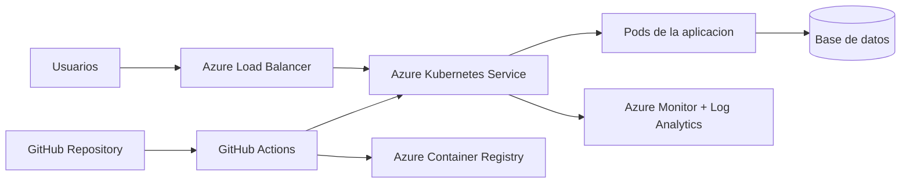

# Proyecto DevOps en Azure

Este repositorio contiene una aplicacion web/API contenerizada y preparada para desplegarse en Azure usando:

- Docker
- GitHub Actions
- Azure Container Registry
- Azure Kubernetes Service
- Azure Monitor / Container Insights

## Arquitectura



## Estructura

```text
.
├── app/
│   ├── package.json
│   └── src/
│       └── server.js
├── k8s/
│   ├── deployment.yaml
│   ├── service.yaml
│   └── namespace.yaml
├── .github/
│   └── workflows/
│       └── azure-aks.yml
├── Dockerfile
├── .dockerignore
├── azure-commands.md
└── control-tareas-azure.md
```

## Ejecucion local

```bash
cd app
npm install
npm start
```

La aplicacion escucha en `http://localhost:3000`.

## Ejecucion con Docker

```bash
docker build -t devops-azure-app:local .
docker run -p 3000:3000 devops-azure-app:local
```

## Despliegue en Azure

Sigue los pasos del archivo [azure-commands.md](./azure-commands.md).

## Evidencias sugeridas

- Captura del Resource Group.
- Captura de ACR con la imagen publicada.
- Captura de AKS con nodos activos.
- Captura del pipeline exitoso en GitHub Actions.
- Captura de pods y servicios con `kubectl get pods,svc -n devops-demo`.
- Captura de la aplicacion funcionando desde la IP publica.
- Captura de Azure Monitor / Container Insights.
